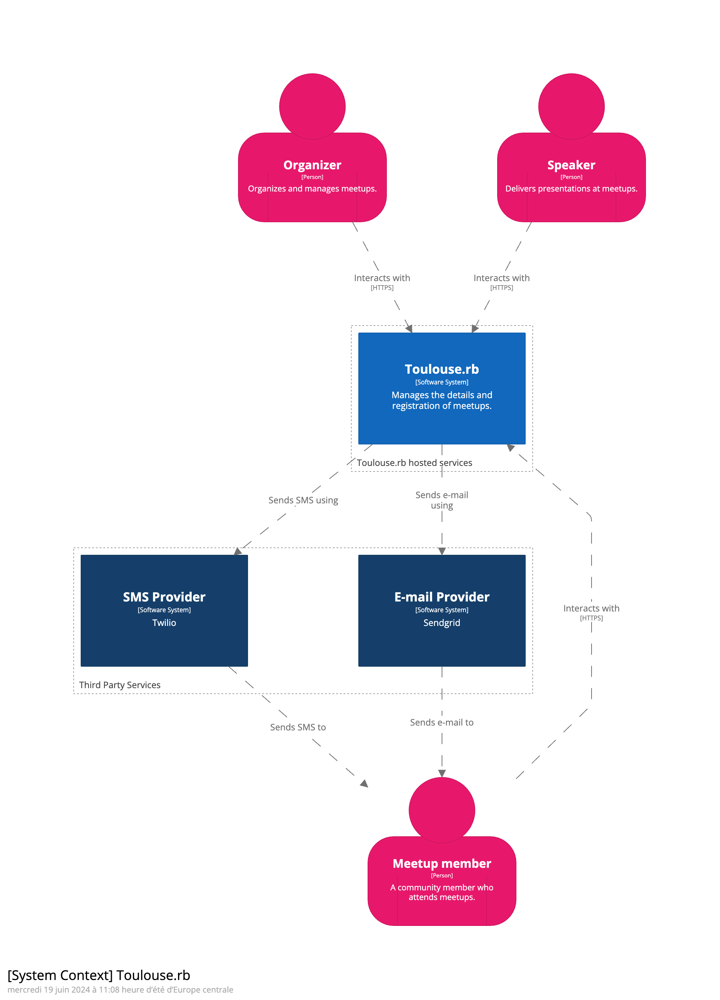
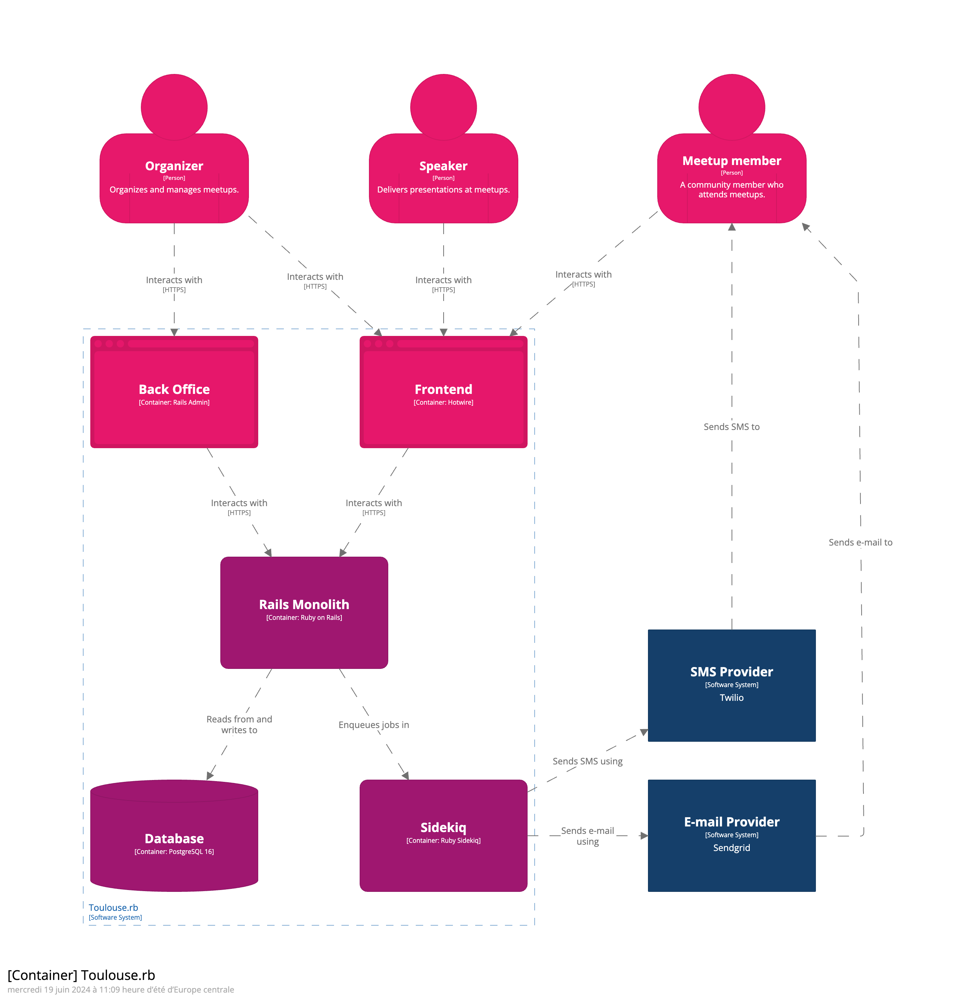
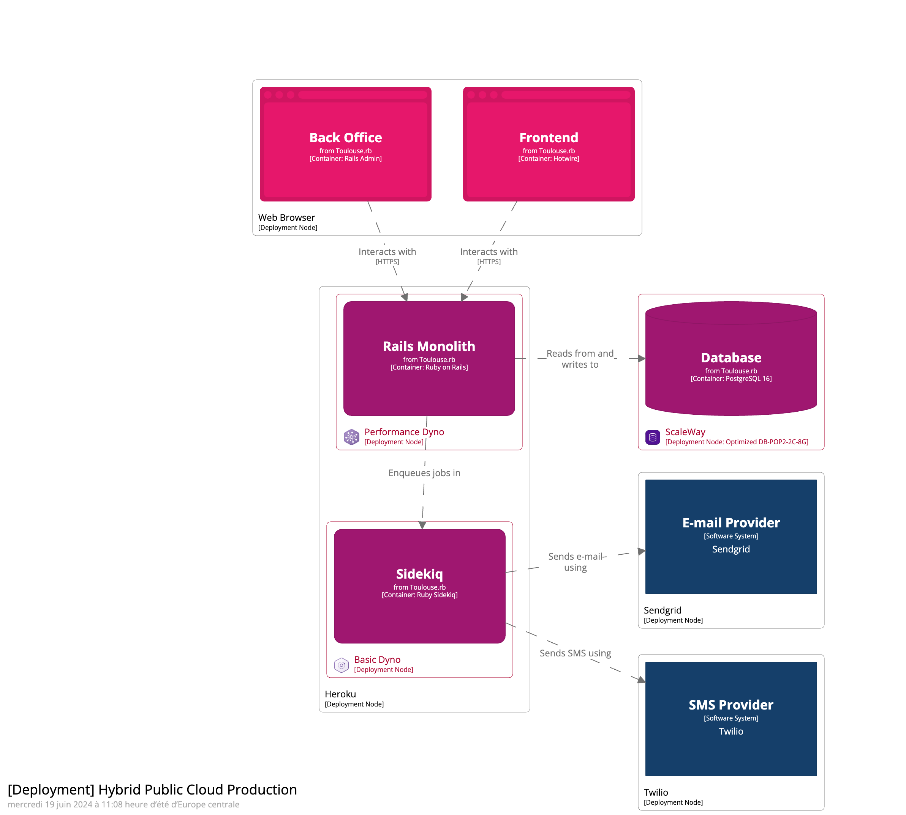

# Diagram as Code : générer ses schémas d’architecture avec C4 Model (Meetup Toulouse.rb)

Présentation réalisée lors du Meetup Toulouse.rb, dans les locaux de Sêmeia le 19/06/2024.

- [Démarrer Structurizr](#démarrer-structurizr)
- [Rendus exportés](#rendus-exportés)
  - [Couche 1 : Système](#couche-1--système)
  - [Couche 2 : Containers](#couche-2--containers)
  - [Couche 3 : Components](#couche-3--components)
  - [Diagramme d'Infrastructure : Single VM](#diagramme-dinfrastructure--single-vm)
  - [Diagramme d'Infrastructure : Hybrid Public Cloud](#diagramme-dinfrastructure--hybrid-public-cloud)
- [Slides](#slides)

## Démarrer Structurizr

Une fois Docker démarré, créez un container en lui partageant le code via un volume :

```shell
docker run -it --rm -p 8080:8080 -v /path/to/the/cloned/github/repository:/usr/local/structurizr structurizr/lite
```

Puis, visitez `localhost:8080`.

## Rendus exportés

### Couche 1 : Système


### Couche 2 : Containers


### Couche 3 : Components


### Diagramme d'Infrastructure : Single VM
.png "Single VM")

### Diagramme d'Infrastructure : Hybrid Public Cloud


## Slides

Les slides sont disponibles [Ici](./slides.pdf).
